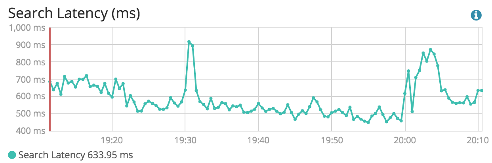

```
WIP, COVERS ELASTICSEARCH 5.5.x, UPDATING TO ES 6.5.x
```

# Designing the Perfect Elasticsearch Cluster

Cluster design is an overlooked part of running Elasticsearch. Both official documentation and blog posts focus on the magic of deploying a cluster in a giffy. Things get more complicated when data start to overflow and users run complex queries that put the whole cluster on their knees.

In this chapter, you'll learn:

* How to design the perfect Elasticsearch cluster.
* That the previous statement is a lie.

> There's no way anyone can tell you how to design a perfect cluster, and those who claim they do are liars.

What you'll find here is a list of things you need to know and understand to design the cluster that fits your needs. Before we get into the details, there's one thing you need to understand.

> Unless you plan to use Elasticsearch to power the search of your blog or a small e-commerce website, your first design will fail.

You can't design a cluster without knowing what your workload will be, how much search and writes per second you'll get, how fast your indexes will grow, and what kind of queries your users will run, against what type of content. And you can't know about your workload unless you've ran your cluster in production for a while. You'll most probably have to iterate 2 or 3 times before you get the design right. I've been running Elasticsearch in production since mid 2011 and I never got it right the first time.

## Elasticsearch is elastic, for real

There are 2 basic concepts you need to understand about Elasticsearch.

The first one is: "you know, for search". This is the response you get when you run an empty query on an Elasticsearch cluster, and that's for a reason.

**Elasticsearch is a search engine. Elasticsearch is not a datastore and it won't replace MySQL.**

If you're looking for a distributed data store, close your tab, you've hit the wrong place.

There's another basic concept that's often poorly understood.

**Elasticsearch is elastic, for real.**

There's 2 things about elasticity when you design your cluster.

The first one is horizontal scaling. You can build a cluster with virtually an infinity of hosts, depending on your needs and the bottleneck you face. Sometimes, running your dataset on a lot of small machines will provide bette performances than using a few large hosts. Sometimes, running on medium hosts with lots of disk is better. And sometimes, you'll need gonzo CPU but storage and memory won't be a problem.

The other one is index sharding. Elasticsearch divides indexes in physical spaces called shards. They allow you to easily split the data between hosts, but there's a drawback as the number of shards is defined at index creation. Elasticsearch default is 5 shards per index, but only your workload will help you to define the right number of shards. Thankfully, there's a way to scale existing indexes in production using reindexing and index aliases.

## Design for failure

Unless you're running Elasticsearch on a single node, prepare to design for failure. Designing for failure means running your cluster in multiple locations and be ready to lose a whole data center without service interruption. It's not theoretical thinking here. You WILL lose a whole data center several times during your cluster's life.

The minimum requirement for a fault tolerant cluster is:

- 3 locations to host your nodes. 2 locations to run half of your cluster, and one for the backup master node.
- 3 master nodes. You need an odd number of eligible master nodes to avoid split brains when you lose a whole data center. Put one master node in each location so you hopefully never lose the quorum.
- 2 http nodes, one in each primary data center.

As many data nodes as you need, split evenly between both main locations.

Architecture of a fault tolerant Elasticsearch cluster


Elasticsearch design for failure

Elasticsearch provides an interesting feature called shard allocation awareness. It allows to split the primary shards and their replica in separated zones. Allocate nodes within a same data center to a same zone to limit the odds of having your cluster go red.

```yaml
cluster:
  routing:
    allocation:
      awareness: 
        attributes: "rack_id"

node:
  attr:
    rack_id: "dontsmokecrack"
```

Using `rack_id` on the http nodes is interesting too, as Elasticsearch will run the queries on the closest neighbours. A query sent to the http node located in the datacenter 1 will more likely run on the same data center data nodes.

## A few things you need to know about Lucene

Before you start to think about choosing the right hardware, there are a few things you need to know about [Lucene](http://lucene.apache.org/).

Lucene is the name of the search engine that powers Elasticsearh. It is an open source project from the Apache Foundation. There's no need to interact with Lucene directly, at least most of the time, when running Elasticsearch. But there's a few important things to know before chosing the cluster storage and file system.

### Lucene segments

Each Elasticsearch index is divided into shards. Shards are both logical and physical division of an index. Each Elasticsearch shard is a Lucene index. The maximum number of documents you can have in a Lucene index is 2,147,483,519. The Lucene index is divided into smaller files called segments. A segment is a small Lucene index. Lucene searches in all segments sequentially.


Lucene creates a segment when a new writer is opened, and when a writer commits or is closed. It means segments are immutable. When you add new documents into your Elasticsearch index, Lucene creates a new segment and writes it. Lucene can also create more segments when the indexing throughput is important.

From time to time, Lucene merges smaller segments into a larger one. the merge can also be triggered manually from the Elasticsearch API.

This behavior has a few consequences from an operational point of view.

The more segments you have, the slower the search. This is because Lucene has to search through all the segments in sequence, not in parallel. Having a little number of segments improves search performances.

Lucene merges have a cost in terms of CPU and I/Os. It means they might slow your indexing down. When performing a bulk indexing, for example an initial indexing, it is recommended to disable the merges completely.

If you plan to host lots of shards and segments on the same host, you might choose a filesystem that copes well with lots of small files and does not have an important inode limitation. This is something we'll deal in details in the part about choosing the right file system.

### Lucene deletes and updates

Lucene performs copy on write when updating and deleting a document. It means the document is never deleted from the index. Instead, Lucene marks the document as deleted and creates another one when an update is triggered.

This copy on write has an operational consequence. As you'll update or delete documents, your indices will grow on the disk unless you delete them completely. One solution to actually remove the marked documents is to force Lucene segments merges.

During a merge, Lucene takes 2 segments, and moves the content into a third, new one. Then the old segments are deleted from the disk. It means Lucene needs enough free space on the disk to create a segment the size of both segments it needs to merge.

A problem can arise when force merging a huge shard. If the shard size is \> half of the disk size, you provably won't be able to fully merge it, unless most of the data is made of deleted documents.

## Hardware

If you want to get serious about Elasticsearch, you'll have to learn about hardware. It might be an unpopular opinion in 2017, but don't run Elasticsearch in the cloud. It has nothing to do with latency or losing your AWS spot instances because Netflix has just released a new show, it has to do with picking up the right hardware for your needs. Cloud providers such as AWS provides vCPU but there's no way you know what you're going to get.

Because they have trouble with Java garbage collection, the first thing people ask advice about is memory management. What you should actually care about is, in no particular order:

* CPU
* Memory
* Network
* Storage

### CPU

Running complex filtered queries, intensive indexing, percolation and queries against non latin charsets have a strong impact on the CPU, so picking up the right one is critical.

Dive into the CPU specs to understand how they behave with Java. It's been more than a decade since I last read Intel specs --- I even used to have them as physical books --- but it prove itself critical to pick up the right hardware.

For example, Xeon E5 v4 provides 60% better performances than the v3 version when running Java. Xeon D works well when you want to scale your cluster horizontally as soon as heavy indexing is split evenly amongst the cluster nodes. Prepare to get into trouble with nodes popping out of the cluster like popcorn otherwise. So picking up the right CPU and horizontal design is critical.

Speaking of CPU, Elasticsearch divides the CPU use into [thread pools](https://www.elastic.co/guide/en/elasticsearch/reference/current/modules-threadpool.html) of various types:

- `generic` for standard operations such as discovery
- `index` for indexing
- `get` for get operations, obviously
- `bulk` for bulk operations such as bulk indexing

These are the most important ones you'll have to deal with, RTFM for everything else

Each pool runs a number of threads, which can be configured, and has a queue, which can be configured too. The default number of threads is defined using a system variable called `allocated_cpu`, which is never greater than 32, even though you have 48 core and the system variable `available_cpu` shows 48.

I wouldn't recommend changing the thread pool size unless you really know what you do, the defaults settings are quite sensible. You might want to adapt the queue size though, as filling the queue size means the operations will be rejected. You can get a glance of your thread pool state using the thread_pool API.

```bash
curl -XGET "localhost:9200/_cat/thread_pool/search?v&h=host,name,active,rejected,completed"
```

A special trick when your cluster is CPU bound and you can support a replica of your data set on every node: run your cluster behind a Haproxy and bypass the http nodes to hit the data node. If you have heterogeneous nodes, give a greater weight to the nodes with the highest number of cores.

### Memory

Elasticsearch runs on Java, and Java is a garbage collected language. Which means you'll run into memory management problems.

Memory is divided in 2 parts: what you allocate to the Java heap space, and everything else. Elasticsearch does not rely on Java heap only. For example, every thread created within the thread pool allocates 256Kb of off-heap memory.

The basic thing to understand with heap allocation is: the more memory you give it, the more time Java spends garbage collecting.

Elasticsearch comes with [Concurrent Mark Sweep](https://docs.oracle.com/javase/8/docs/technotes/guides/vm/gctuning/cms.html) as a default garbage collector. CMS runs multiple concurrent threads to scan the heap for objects that can be recycled. The main problem with CMS is how it might enter "stop the world" mode in which the JVM becomes unresponsive until it is restarted. The main reason for stop the world is when the application has changed the state of the heap while CMS was running concurrently, forcing it to restart from scratch until it has all the objects marked for deletion. Let's put it this way: CMS sucks donkey balls when the heap is over 4GB, which is almost always the case with Elasticsearch.

Java 8 brings a brand new garbage collector called Garbage First, or G1, designed for heaps greater than 4GB. G1 uses background threads to divide the heap into 1 to 32MB regions, then scan the regions that contain the most garbage objects first. Elasticsearch and Lucene does not recommend using G1GC for many reasons, one of them being [a nasty bug on 32bits JVM](https://bugs.openjdk.java.net/browse/JDK-8038348) that might lead to data corruption. From an operational point of view, switching to G1GC was miraculous, leading to no more stop the world and only a few memory management issues.

That said, choosing the right amount of memory to fill in the heap is the most touchy part of designing an Elasticsearch cluster. Whatever you pick up, never allocate more than 31GB to the heap.

Elasticsearch provides plenty of metrics to understand how the workload wights on the memory.

```bash
curl -XGET "localhost:9200/_nodes/stats"
```

Elasticsearch uses multiple buffers to perform in memory operations, as well as caches to store the queries results with a system of LRU when the cache becomes full. When the results are mostly large datasets and the queries are not repeated often, disabling the caches might be a good idea.

The caches you need to monitore are:

- the [`query cache`](https://www.elastic.co/guide/en/elasticsearch/reference/current/query-cache.html): defined per node, with a default of 10% of the heap.
- the [`shard request cache `](https://www.elastic.co/guide/en/elasticsearch/reference/current/shard-request-cache.html): used to compute the result of queries ran on multiple shards.
- the [`fielddata cache`](https://www.elastic.co/guide/en/elasticsearch/reference/current/modules-fielddata.html): limited to 30% of the total heap.

Since version 5, Elasticsearch buffers were simplified, and there are only 2 buffers to monitor:

- the [`indexing buffer`](https://www.elastic.co/guide/en/elasticsearch/reference/current/indexing-buffer.html): it is used to buffer data during the indexing process.
- the `buffer_pools`.

Elasticsearch is not idiotproof and won't tell you if you allocate more than 100% of the heap to the multiple buffers and caches, unless you try to fill them all at the same time. Then you'll get an out of memory error.

I said earlier that too much memory might lead to management issues. Actually, the more memory the better when you play outside of the heap. The off heap memory is used to manage threads and for the filesystem to cache the data.

Elasticsearch [file system storage](https://www.elastic.co/guide/en/elasticsearch/reference/current/index-modules-store.html) has an important impact on the cluster performances. After trying both ElasticSearch default_fs and mmapfs, I've picked up niofs for file system storage.

> The NIO FS type stores the shard index on the file system (maps to Lucene NIOFSDirectory) using NIO. It allows multiple threads to read from the same file concurrently.

Niofs lets the kernel manage the file system cache instead of relying on the broken, out of memory error generator mmapfs.

You might also want to commit the exact amount of memory you want to allocate to the heap at startup. This prevents the node from swapping when trying to allocate the memory it needs because no more memory is available.

```yaml
# previously bootstrap.mlockall
boostrap:
  memory_lock: true 
```

### Network

Let's put it this way: you never have too much bandwidth. 1GB is good, 10GB is better, and a low latency is even better. Elasticsearch performs lots of network consuming operations, from transferring data during queries to reallocating shards, so networking matters.

The multicast discovery plugin was removed from Elasticsearch 5, so discovery is done either using unicast or a cloud plugin, but you won't run Elasticsearch in the cloud, will you?

If your hosting provider allows it, activate the Jumbo frames on your network interfaces. Jumbo frames might reduces the network latency by about 15% which is noticeable when transferring large amount of data.

```bash
ifconfig eth0 mtu 9000
```

Elasticsearch comes with some interesting network related settings, which are low by default and won't go over 2Gb/s, notably the recovery transfer which is limited to 40mb/s

```yaml
indices:
  recovery:
    max_bytes_per_sec: "2g"
```

Raise this value only if your storage can handle it while serving queries, indexing, and performing administrative tasks such as merges.

### Storage

After memory, storage is often the bottleneck of an Elasticsearch cluster. Unless you have a good reason to do it, don't use spinning disks. Large SSD drives are now affordable with a decent life expectancy, and you'll need fast IOs. Also, prefer local storage to anything else to reduce the reads and writes latency. Consider your data nodes as disposable when possible.

A question that comes often about storage design is: **should I go with RAID0, RAID1(0) or JBOD?**

**RAID0** offers the best cost / speed / storage space ratio. It fits perfectly in large clusters where losing a node is not a problem. RAID0 offers the maximum storage space on a single file system, which is convenient when managing large shards. Without enough available storage on a single node, operations like index optimisation won't be possible. RAID0 also offers the maximum number of axes, without the RAID1(0) replication overhead, useful for intensive indexing.

On the other hand, losing a single disk means losing a whole data node, so choosing RAID0 implies to have enough spare data nodes to store the whole dataset in case of crash.

**JBOD** offers the best cost / storage / security ratio. Each disk is affected to a mountpoint, and the mountpoints are listed in Elasticsearch configuration. JBOD is a good choice when you can't afford to lose a whole data node, but losing a whole disk is OK, but provides less read and write performances. Running large shards on JBOD can also be a problem to perform administrative tasks like index optimisation.

Depending on how many data nodes you can afford to lose, running many hosts with software RAID0 is the best speed / storage space / cost setup. Otherwise, use JBOD to reduce the I/Os involved by RAID 1 and RAID10 replication.

**RAID1(0)** is the option for people who run Elasticsearch on a single node. It provides the maximum security for the data availability as losing a disk is possible, but at the cost of space and performances. RAID1(0) implies to use half of the storage for the RAID replication, and the replication overhead is something to take into account.

Elasticsearch comes with 2 storage related throttling protection. The first one limits the bandwidth of the storage you can use, and is as low as 10mb/s. You can change it in the nodes settings:

```yaml
indices:
  store:
    throttle:
      max_bytes_per_sec: "2g"
```

The second one prevents too many merges from happening, which slows down your indexing process. If you run bulk indexing or don't care about search speed, you can disable merge throttling entirely.

```yaml
indices:
  store:
    throttle:
      type: "none"
```

## Software

Once done with the hardware, there's a few things you should have a look at on the software level before you install Elasticsearch.

### The Linux (or FreeBSD) kernel

The Linux kernel version you run on is important. Prefer the 4.9.x version as it provides many interesting fixes and performances improvements, and comes with a great tracing framework you can rely on when troubleshooting performances. Take the time to read the Kernel CHANGELOG every time a new release is out, it and don't mind upgrading often if it's worth it. For example, Linux 4.9.25 (or 4.9.0.0-BPO3 on Debian) fixed many regressions on XFS introduced with the 4.9.13 that screwed up the filesystem performances.

### The Java Virtual Machine

The JVM you pick up is critical too, and you need to read and understand their specifications to get the best of your cluster. Elasticsearch runs best on Java 1.8, which provides G1GC, and does not support the unreleased Java 1.9 yet, but it supports various flavors of the Java virtual machine, so chose wisely. I usually run the Oracle JVM, but OpenJDK is cool too. Once again, don't mind upgrading your Java version often if a release fixes bugs of improve performances. Elasticsearch is not MySQL, and rebooting often is OK. Read the CHANGELOG to stay up to date.

### The filesystem

Last but not least, choosing the filesystem is a critical part of designing an Elasticsearch cluster. With small datasets on your disks, Ext4 is a fast, reliable option that does not need tuning. If you plan to store lots of indexes and more than 1TB of data per node, prefer a well tuned XFS for better performances.

TODO: add XFS tuning examples

## Designing your indices

Designing indices is the worst part of the cluster, because if you screw up, all you have left is to scratch and reindex. This part won't deal about designing a mapping, it's way beyond the cluster design. We'll talk about 2 things: sharding and replication.

### Sharding

Sharding is one of the reasons Elasticsearch is elastic. Elasticsearch divides the data in logical parts, so he can allocate them on all the cluster data nodes. The bad news is: sharding is defined when you create the index. Once done, the only way to change the number of shards is to delete your indices, create them again, and reindex.

Choosing the right number of shards is complicated because you never know how many documents you'll get before you start. When I know more or less the future size of an index, I do the following:

* less 3M documents: 1 shard
* between 3M and 5M documents with an expected growth over 5M: 2 shards
* more than 5M: int (number of expected documents / 5M +1)

Having lots of shards can be both good and terrible for a cluster. Indices and shards management can overload the master node, which might become unresponsive, leading to some strange and nasty behaviour. Allocate your master nodes enough resources to cope with the cluster size. I try not to run more than 10.000 open indices and 50.000 primary shards on the same cluster.

If you plan to use [Elasticsearch routing](https://www.elastic.co/guide/en/elasticsearch/reference/current/mapping-routing-field.html), don't create more shards than you need, otherwise you'll end up having lots of empty shards that just add useless pressure on the data and master nodes.

On the other hand, having lots of shards on huge indices is good too, specially when you have a large cluster (20 data nodes and more).

Multiple shards allow a better allocation between nodes.

Small shards on multiple nodes make the cluster recovery much faster when you lose a data node or shutdown the cluster.

Spreading smaller shards on lots of nodes might solve your memory management problems when running queries on a large data set.

Large shards makes indices optimization harder, specially when you run `force_merge` with `max_num_segments=1` since you need twice the shard size in free space.

There's one more thing about sharding. Lucene, the search engine that powers Elasticsearch, creates many files to manage parallel indexing on the same shard. These files are called segments, and depending on your indexing workload, Lucene can create and open thousands of them at the same time. That's why it's important to run Elasticsearch with `max_open_files` at 32.000, if not more.

### Replication

Elasticsearch has a built in replication system. Data is replicated amongst the data nodes so losing one of them won't mean a data loss. Elasticsearch default replication factor is 1, but it might be interesting to have a higher replication factor.

Before you start playing with replication, you might want to understand Elasticsearch replication consistency formula:

```
int( (primary + number_of_replicas) / 2 ) + 1
```

Going beyond the factor 1 can be extremely useful when you have a small dataset and a huge amount of queries. By allocating the whole data set to every node, you can leverage the search thread pools to run much more queries in parallel. I once went to a replication factor of 51, on 52 nodes, with the whole dataset in memory.

## Optimising allocation

Once you use rack awareness, it might be interesting to optimise shard allocations using [elasticsearch zones](https://www.elastic.co/guide/en/elasticsearch/reference/current/allocation-awareness.html).

For example, if you have indices that are accessed more frequently than others, you might want to allocate more data nodes to those indices while the less frequently accessed indices have less resources allocated. This is extremely efficient with timestamped indices.

Let's say you have 20 data nodes, and 30 indices, you can create 3 zones. Allocate your 30 nodes to these zones according to the needed resources:

* new: 15 nodes
* general: 10 nodes
* old: 5 nodes

Every day, run a crontab to reallocate your indices to their new zone. For example, move a less accessed index into the "general" zone:

```bash
curl -XPUT "localhost:9200/index/_settings" -H 'Content-Type: application/json' -d '
{
  "transient": {
    "cluster.routing.allocation.include._zone" : "general",
    "cluster.routing.allocation.exclude._zone" : "new,old"
  }
}
'
```

## Troubleshooting and scaling

Troubleshooting and scaling your cluster requires lots of investigation and understanding of your workload and cluster behaviour. Here's what you should care about:

* Buffers
* Cache (both filling, hit & miss, and eviction)
* CPU use and load average
* OOM errors

### CPU

If you're CPU bound, there's a few things you need to pay attention to:

CPU consumption: > 90% you'll get into trouble. Your data node need to perform frequent administrative tasks such as getting the cluster state, sending information to the master or merging.

Load average: a high load average might imply an IO issue, a context switching problem, some nasty Java or kernel bugs...

The state of your thread pools, especially the state of rejected threads. And raising the queue size is never the right solution on the long term.

The number of search / writes per second


The average time taken by your queries



A good way to know which queries take the more time is by using Elasticsearch slow queries logs.

```bash
curl -XPUT "localhost:9200/index/_settings" -H 'Content-Type: application/json' -d '
{
  "index.search.slowlog.threshold.query.warn: 1s",
  "index.search.slowlog.threshold.query.info: 500ms",
  "index.search.slowlog.threshold.query.debug: 1500ms",
  "index.search.slowlog.threshold.query.trace: 300ms",
  "index.search.slowlog.threshold.fetch.warn: 500ms",
  "index.search.slowlog.threshold.fetch.info: 400ms",
  "index.search.slowlog.threshold.fetch.debug: 300ms",
  "index.search.slowlog.threshold.fetch.trace: 200ms"
}
'
```

If you can't optimize your queries, then you'll have to add more resources or rewrite everything to better use Elasticsearch, or something else.

### Memory

Memory management issues used to be my worst nightmare. Thankfully it's not anymore. There are many tools to investigate the content of Elasticsearch memory, either in real time or after a crash. My favourite is [Yourkit Java Profiler](https://www.yourkit.com/java/profiler/features/), which has a free trial version.

If you experience multiple memory related crashes, make sure Elasticsearch dumps its memory when crashing. If you allocate 31GB to the heap you'll get 31GB dumps, so expand your filesystem accordingly, and activate memory dumps.

```bash
-XX:+HeapDumpOnOutOfMemoryError -XX:HeapDumpPath=/srv/elasticsearch/heapdump.hprof
```