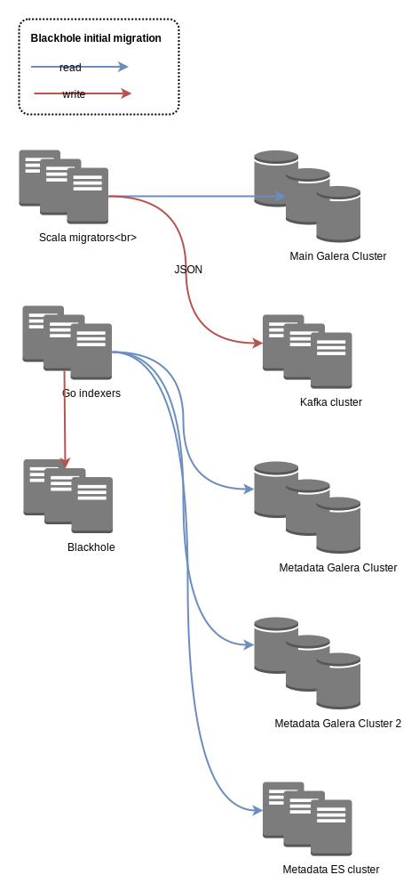
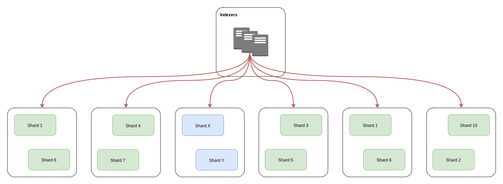
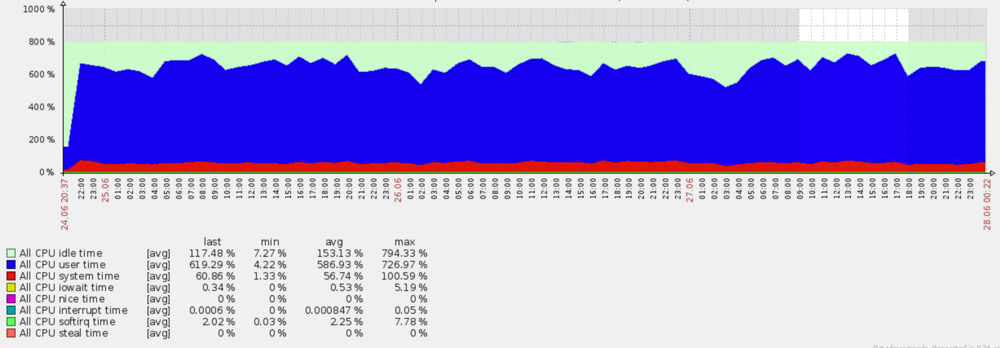

```
WIP, COVERS ELASTICSEARCH 5.5.x
```

# Use Case: How we reindexed 36 billion documents in 5 days within the same Elasticsearch cluster

At [Synthesio](http://www.synthesio.com/), we use [ElasticSearch](http://elastic.co/) at various places to run complex queries that fetch up to 50 million rich documents out of tens of billion in the blink of an eye. Elasticsearch makes it fast and easily scalable where running the same queries over multiple MySQL clusters would take minutes and crash a few servers on the way. Every day, we push Elasticsearch boundaries further, and going deeper and deeper in its internals leads to even more love.

Last week, we decided to reindex a 136TB dataset with a brand new mapping. Updating an Elasticsearch mapping on a large index is easy until you need to change an existing field type or delete one. Such updates require a complete reindexing in a separate index created with the right mapping so there was no easy way out for us.

---

## The "Blackhole" cluster

We've called our biggest Elasticsearch cluster "Blackhole", because that's exactly what it is: a hot, ready to use datastore being able to contain virtually any amount of data. The only difference with a real blackhole is that we can get our data back at the speed of light.

When we designed blackhole, we had to chose between 2 different models.

A few huge machines with 4 * 12 core CPU, 512GB of memory and 36 800GB SSD drives, each of them running multiple instances of Elasticsearch.

A lot of smaller machines we could scale horizontally as the cluster grows.

We opted for the latter since it would make scaling much easier and didn't require spending too much money upfront.

Blackhole runs on 75 physical machines:

* 2 http nodes, one in each data center behind a [HAProxy](http://www.haproxy.org/) to load balance the queries.
* 3 master nodes located in 3 different data center.
* 70 data nodes into 2 different data center.

Each node has quad core Xeon D-1521 CPU running at 2.40GHz and 64GB of memory. The data nodes have a RAID0 over 4*800GB SSD drives with XFS. The whole cluster runs a Systemd less Debian Jessie with a 3.14.32 vanilla kernel. The current version of the cluster has 218,75TB of storage and 4,68TB of memory with 2.39TB being allocated to Elasticsearch heap. That's all for the numbers.

---

## Elasticsearch configuration

Blackhole runs ElasticSearch 1.7.5 on Java 1.8. Indexes have 12 shards and 1 replica. We ensure each data center hosts 100% of our data using Elasticsearch [rack awareness](https://www.elastic.co/guide/en/elasticsearch/reference/current/allocation-awareness.html) feature. This setup allows to crash a whole data center without neither data loss nor downtime, which we test every month.

All the filtered queries are ran with `_cache=false` ElasticSearch caches the filtered queries result in memory, making the whole cluster explode at the first search. Running queries on 100GB shards, this is not something you want to see.

When running in production, our configuration is:

```yaml
routing:
	allocation:
		node_initial_primaries_recoveries: 20
		node_concurrent_recoveries: 20
		cluster_concurrent_rebalance: 20

disk:
	threshold_enabled: true
	watermark:
		low: 60%
		high: 78%

index:
	number_of_shards: 12
	number_of_replicas: 1

merge:
	scheduler:
		max_thread_count: 8
		type: 'concurrent'
	policy:
		type: 'tiered'
		max_merged_segment: 100gb
		segments_per_tier: 4
		max_merge_at_once: 4
		max_merge_at_once_explicit: 4

store:
	type: niofs

query:
	bool:
		max_clause_count: 10000

action:
	auto_create_index: false

indices:
	recovery:
		max_bytes_per_sec: "2048mb"
	fielddata:
		breaker:
			limit: "80%"
		cache:
			size: "25%"
			expire: "1m"

store:
	throttle:
	type: "none"

discovery:
	zen:
		minimum_master_nodes: 2

ping:
	multicast:
		enabled: false
	unicast:
		hosts: ["master01","master02","master03"]

threadpool:
	bulk:
		queue_size: 3000
		type: "cached"
	index:
		queue_size: 3000
		type: "cached"

bootstrap:
	mlockall: true

memory:
	index_buffer_size: "10%"

http:
	max_content_length: "1024mb"
```

After trying both ElasticSearch default_fs and mmapfs, we've picked up [niofs](https://www.elastic.co/guide/en/elasticsearch/reference/current/index-modules-store.html)for file system storage.

> The NIO FS type stores the shard index on the file system (maps to Lucene [NIOFSDirectory](https://lucene.apache.org/core/5_2_0/core/org/apache/lucene/store/NIOFSDirectory.html)) using NIO. It allows multiple threads to read from the same file concurrently.

The reason why we decided to go with niofs is to let the kernel manage the file system cache instead of relying on the broken, out of memory error generator mmapfs.

---

## Tuning the Java virtual machine

We launch the java virtual machine with `-Xms31g -Xmx31g`. Combined with ElasticSearch `mlockall=true`, it ensures ElasticSearch gets enough memory to run and never swaps. The remaining 33GB are used for ElasticSearch threads and file system cache.

Despite ElasticSearch recommendations we have replaced the [Concurrent Mark Sweep](https://docs.oracle.com/javase/8/docs/technotes/guides/vm/gctuning/cms.html) (CMS) garbage collector with the [Garbage First Garbage Collector](http://www.oracle.com/technetwork/tutorials/tutorials-1876574.html) (G1GC). With CMS, we would run into a stop the world garbage collection for every single query on more than 1 month of data.

Our configuration of G1GC is relatively simple but does the job under pressure:

```bash
JAVA_OPTS="$JAVA_OPTS -XX:-UseParNewGC"
JAVA_OPTS="$JAVA_OPTS -XX:-UseConcMarkSweepGC"
JAVA_OPTS="$JAVA_OPTS -XX:+UseCondCardMark"
JAVA_OPTS="$JAVA_OPTS -XX:MaxGCPauseMillis=200"
JAVA_OPTS="$JAVA_OPTS -XX:+UseG1GC "
JAVA_OPTS="$JAVA_OPTS -XX:GCPauseIntervalMillis=1000"
JAVA_OPTS="$JAVA_OPTS -XX:InitiatingHeapOccupancyPercent=35"
```

### Blackhole Initial indexing

We started the initial indexing mid December 2015. It took 19 days from fetching the raw data to pushing it into ElasticSearch.

Back then, Blackhole only had 46 nodes:

* 3 master nodes
* 1 query node
* 42 data nodes

This led to a cluster sized for 30 months of data with 1.29TB of memory and 134TB of storage, all SSD.

For this initial indexing, we decided to go with 1 index per month and 30 shards per index. This didn't work as expected as each query on a month would request data from 3TB and 1.2 billion documents. As most queries went on 3 to 12 months, this made the cluster impossible to scale properly.

The first part of the process took 10 days. We had to fetch 30 billion documents from our main [Galera](http://galeracluster.com/products/) datastore, turn it into JSON and push it into a [Kafka](https://kafka.apache.org/) queue, each month of data being pushed into a different Kafka partition. Since we were scanning the database incrementally, the process went pretty fast considering the amount of data we were processing.

The migration processes were running on 8 virtual machines with 4 core and 8GB RAM. Each machine was running a 8 processes of a [Scala](http://www.scala-lang.org/) homemade program.

During the second part, we merged the data from the Kafka with data from 2 other Galera clusters and an Elasticsearch cluster before pushing them into Blackhole.



## Blackhole initial migration

The merge and indexing parts took place on 8 virtual machines, each having 4 core and 8GB RAM. Each machine was running 8 indexing processes reading an offset of a Kafka partition.

The indexer was shard aware. It had a mapping between the index it was writing on, its shards and the data node they were hosted on. This allowed to index directly on the right data nodes with the lowest possible network latency.


This part was not as smooth as we expected.

The first version of the indexer was developed in Scala, but for some reasons was slow as hell, not being able to index more than 30,000 documents per second. We rewrote it in Go in 2 days, and it was much better, with an average of 60,000 indexed documents per second, with peaks at 120,000 documents per second.

Surprisingly, the main bottleneck was neither one of the Galera clusters nor the Elasticsearch metadata cluster, but the Kafka queues. For some reasons, we could not read more than 10,000 documents per second per Kafka partition.

The other unexpected bottleneck was the CPU. Surprisingly, we were CPU bound but the disks were not a problem (which is normal since we're using SSDs).


After 9 days, the data was fully indexed and we could start playing with the data.

---

## Blackhole reindexing

When we decided to change Blackhole mapping, we had enough experience with the cluster and its content to avoid previous mistakes and go much faster.

Instead of monthly indexes, we decided to split the cluster into daily indexes. A few tests on a migrating index showed it was the way to go.

With the new mapping dropping a bunch of data, we moved from 3GB for 1 million documents (with a replica) to 2GB for 1 million documents. Going daily reduced the average index from 3TB to 120GB, and a single shard from 100GB to 10GB. Having a large number of machines, this allowed to better use the ressources, starting with the JVM heap, running parallel queries.

### The reindexing process

Instead of polling the data from our database clusters, we decided to reuse the data from Blackhole itself. This meant reading and writing on the same cluster simultaneously, adding some fun in the operation.

This time, we did not use separate virtual machines to host the indexing processes. Instead, we decided to run the indexers on the data nodes, read locally and write on their counterpart in the secondary data center. Considering a 10Gb link and a 46ms network latency, that solution was acceptable. It meant we had 70 machines to both read and write to, allowing maximum parallelism.

There are many solutions to copy an Elasticsearch index to another, but most of them neither allow splitting one to many or change the data model. Unfortunately, the new mapping involved deleting some fields and moving other fields somewhere else. Since we did not have the time to build a homemade solution, we decided to go with [Logstash](https://www.elastic.co/products/logstash).

Logstash has both an Elasticsearch input, for reading, an Elasticsearch output, for writing, and a `transform` filter to change the data model. The `input` module accepts a classic Elasticsearch query and the `output` module can be parallelized.

We ran a few tests on Blackhole to determine which configuration was the best, and ended with 5000 documents scrolls and 10 indexing workers.


Testing with 5000 documents scroll and 10 workers

For these tests, we were running with a production configuration, which explains the refreshes and segment count madness. Indeed, running with 0 replica was faster, but since we're using RAID0, this configuration was a no go.

During the operation, both source and target nodes behaved without problems, specifically on the memory level.


Source node for reindexing


Target node behavior

For the first tests, we ran logstash against a full day of reindexation, using a simple Elasticsearch query:

```json
{
  "query": {
    "range": {
      "date": {
        "gte": "yyyy-mm-ddT00:00.000",
        "lte": "yyyy-mm-dd+1T00:00.000+01:00"
      }
    }
  }
}
```

Unfortunately, for some reasons, we had missing documents because our scroll keepalive of 5 minutes was too short. This made catching up with the data too long as we had to replay the whole day, so we decided to run hourly queries.

### Logstash configuration

```
input {
	elasticsearch {
		hosts => [ "local elasticsearch node" ]
		index => "index to read from"
		size => 5000
		scroll => "20m" # 5 minutes initial
		docinfo => true
		query => '{ "query": { "range": { "date": { "gte": "2015-07-23T10:00.000+01:00", "lte": "2015-07-23T11:00.000+01:00" } } } }'
	}
}

output {
	elasticsearch {
		host => "remote elasticsearch node"
		index => "index to write to"
		protocol => "http"
		index_type => "%{[[[@metadata]{.underline}](http://twitter.com/metadata)][_type]}"
		document_id => "%{[[[@metadata]{.underline}](http://twitter.com/metadata)][_id]}"
		workers => 10
	}

	stdout {
		codec => rubydebug # because removing the timestamp field makes logstash crash
	}
}

filter {
	mutate {
		rename => { "some field" => "some other field" }
		rename => { "another field" => "somewhere else" }
		remove_field => [ "something", "something else", "another field", "some field", "[@timestamp]", "[@version]" ]

	}
}
```

### Reindexing Elasticsearch configuration

We changed only a few settings for that reindexing.

```yaml
memory:
	index_buffer_size: 50% # (instead of 10%)

index:
	store:
		throttle:
			type : "none" (as fast as your SSD can go)

	translog:
		disable_flush: true
	refresh_interval: -1 # (instead of 1s)

indices:
	store:
		throttle:
			max_bytes_per_sec: "2gb"
```

We wanted to limit the Lucene refreshes as much as we could, preferring to manage hundreds of thousand segments instead of limiting our throughput for CPU overhead.

### Introducing Yoko and Moulinette

To manage the indexing process, we have created 2 simple tools: Yoko and Moulinette.

Yoko and Moulinette use a simple MySQL database with every index to process, query to run and status. The data model is pretty self explanatory:

```sql
CREATE TABLE `yoko` (
  `index_from` varchar(16) NOT NULL,
  `index_to` varchar(16) NOT NULL,
  `logstash_query` text NOT NULL,
  `status` enum("todo", "processing", "done", "complete", "failed") DEFAULT "todo"
);
```

Before indexing, we fill in the Yoko database with every index we want to migrate along with all the logstash queries we need to run. One line contains the source index, destination index and the query to reindex 1 hour of data.

Yoko is a simple Python daemon that manages the global indexing processes. It:

Creates the daily indexes when they don't exist yet with the right mapping.

Checks for every "done" daily index and compares the number of documents from the initial index running the logstash query.

Moves each successful "done" line to "complete" if the count matches or "failed".

Delete each monthly index when every day of a month is "complete".

Changes the refresh values when a daily index is "complete".

```bash
curl -XPUT "localhost:9200/index/_settings" -H 'Content-Type: application/json' -d '
{
	"translog.disable_flush" : "false",
	"index" : {
		"refresh_interval" : "1s"
	}
}
'
```

Moulinette is the processing script. It's a small daemon written in Bash (with some ugly bashisms) that runs on every indexing node. It fetches lines in "todo" from the *yoko* table, generates the logstash.conf with the source and destination index, and source and destination node and Logstash query. Then it runs Logstash, and once Logstash exits, switches the line to "done" if Logstash exit code is 0, or "failed" otherwise.

---

## Reindexing in 5 days

Once again, the main problem was being CPU bound. As you can see on that Marvel screenshot, the cluster was put under heavy load during the whole indexing process. Considering that we were both reading and writing on the same cluster, **with an indexing rate over 90,000 documents per second with 140,000 documents per second peaks**, this is not surprising at all.


Having a look at the CPU graphs, there was little we could to to improve the throughput without dropping Logstash and relying on a faster solution running on less nodes.



The disks operations show well the scroll / index processing. There was certainly some latency inside Logstash for the transform process, but we didn't track it.


The other problem was losing nodes. We had some hardware issues and lost some nodes here and there. This caused indexing from that node to crash and indexing to that node to stale since Logstash does not exit when the output endpoint crashes.

This caused many lost time checking (almost) manually logs on every node once or twice a day. If an hourly index took more than 3 hours to process, we would consider it lost and restart Moulinette and move the hourly index to "todo".

Lesson learned, Yoko and Moulinette V2 will have a better silent error handling. When an index is blocked for more than 3 hours, Yoko will raise an alert and move the index to "todo". The alert will allow to kill the locked Logstash process and restart Moulinette as soon as there's a problem.

The next step is optimizing the indexes, moving from an average of 1500 Lucene segments post indexing to 24 (1 segment per replica). This aims both at improving the performances and removing completely the deleted documents we had after restarting the indexing post crash. When overwriting or deleting a document, Lucene does not actually delete it but flags it at "deleted" until an optimize is performed.

Our optimize script is extremely simple, starting with the indexes that have the most important number of deleted documents to save space.

```bash
#!/bin/sh

HOST=$1
CURL_BIN=$(which curl)

if [ -z "$HOST" ]; then
	echo "Host is missing"
	exit 1
fi

if [ -z "$CURL_BIN" ]; then
	echo "Curl binary is missing"
	exit 1
fi

for indice in $(${CURL_BIN} -XGET [[http://$]{.underline}](http://$/){HOST}:9200/_cat/indices | sort -rk 7 | awk '{print $3}'); do

	if [ ! -z "$indice" ]; then
		echo $(date +"%Y%m%d %H:%M") Processing indice ${indice}
		${CURL_BIN} -XPOST [[http://$]{.underline}](http://$/){HOST}:9200/${indice}/_optimize?max_num_segments=1
		echo
	fi
done

exit 0
```

---

## Conclusion

Reindexing a large Elasticsearch cluster with major data mode changes was quite interesting. It allowed us to push Elasticsearch and our hardware boundaries to reach a correct throughput. Yoko and Moulinette are now reusable for every Elasticsearch cluster we run at Synthesio, allowing reindexing within a same cluster or cross clusters.
