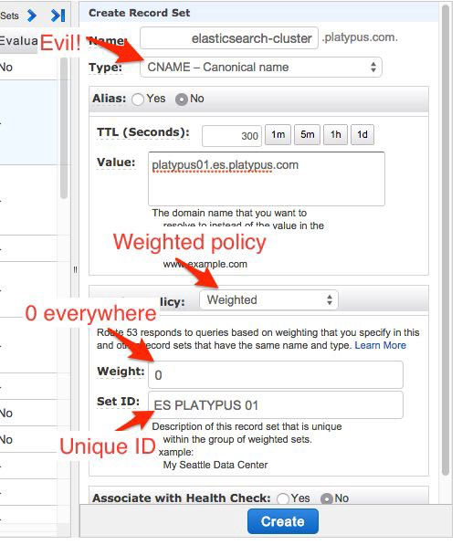

```
WIP, COVERS ELASTICSEARCH 5.5.x, UPDATING TO ES 6.5.x
```

# Use Case: Migrating a Cluster Across the Ocean Without Downtime

I had to migrate a whole cluster from Canada to France without downtime.

With only 1.8TB of data, the cluster was quite small. However, crossing the ocean on an unreliable network made the process long and hazardous.

My main concern was about downtime: it was not an option. Otherwise I would have shutdown the whole cluster, rsync the data and restarted the Elasticsearch processes.


To avoid downtime, I decided to connect both clusters and rely on Elasticsearch elasticity. It was made possible because this (rather small) cluster relied on unicast for discovery. With unicast discovery, you add a list of node in your Elasticsearch configuration, and you let it discover his pairs. This is something I did once, but not cross continent!

First step was to connect both clusters using unicast. To do this, I've added the IP address of the Canadian master nodes to one of the French cluster nodes configuration. I updated both machines firewall rules to they were able to communicate on port 9300, then restarted the Elasticsearch process.

At first, I only launched one French node, the one I planned to communicate with the Canadian one as a gateway. After a few hours of shard relocation, everything was green again, and I just I was able to shutdown the first Canadian data node.

That's when I launched the 2 other French nodes. They only knew about each other and the *gateway* node. They did not know anything about the Canadian ones, but it worked like a charm.

If for some reason you can't expose your new Elasticsearch cluster, what you can do is add a http only node, you will use as a bridge. Just ensure it can communicate with both clusters by adding 1 IP of each of their nodes, it works quite well, even with 1 public and 1 private subnet. This gateway provides another advantage: you don't need to update your clusters configuration to make them discover each other.

Once again, it took a few hours to relocate the shards within the cluster, but it was still working like a charm, getting his load of reads and writes from the application.

Once the cluster was all green, I could shutdown the second Canadian node, then the third after some relocation madness.

You may have noticed that at that time, routing nodes were still in Canada, and data in France.


That's right. The latest part of it was playing with DNS.



The main ES hostname the application accesses is managed using Amazon Route53. Route53 provides some nice round robin thing so the same A record can point to many IPs or CNAME with a weight system. It's pretty cool even though it does not provide failover. If one of your nodes crash, it needs to unregister itself from route53.

As soon as the data transfer was OK, I was able to update route53, adding 3 new records to route53. Then, I deleted the old records and removed the routing nodes from the cluster. Mission successful.
