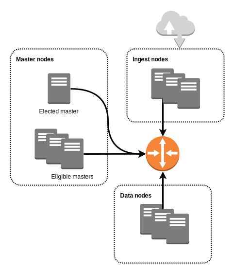

```
涵盖ELASTICSEARCH 5.5.x，正在升级到ES 6.5.x
```

# Elasticsearch入门

这一章是写给还没有使用过Elasticsearch的人，它涵盖了Elasticsearch基本的概念，并指引你部署和使用你的第一个单节点的集群。每个在这里提及的概念在后文都会有详细的解释。

在这个章节你将学习到:

- Elasticsearch背后的基础概念
- 什么是Elasticsearch集群
- 如何在最常用的操作系统中部署你的第一个、单节点的Elasticsearch集群
- 如何使用Elasticsearch索引文档和查找内容
- Elasticsearch基础配置
- 什么是Elasticsearch插件和如何使用他们

---

## 读前须知

为了阅读这本书和进行这个章节描述的操作，你需要:

- 一台运行着主流Linux或Unix环境机器或者虚拟机，如Debian / Ubuntu，RHEL / CentOS 或 FreeBSD. 在Mac OS和Windows上运行Elasticsearch不在这本书的涵盖范围内
- 一些基础的UNIX命令行知识和终端的使用
- 你最喜欢的文本编辑器

如果你之前还没有使用过Elasticsearch，我建议你创建一个虚拟机，防止你意外损坏你的宿主机系统。你也可以使用一个虚拟化工具如[Virtualbox](https://www.virtualbox.org/)来运行它，或着在你最喜欢的云服务提供商机器上。

---

## Elasticsearch基础概念

Elasticsearch是一个使用Java编写的分布式的、可扩展的、具备容错能力的开源的搜索引擎。它提供了一个强大的REST API，用于添加、搜索数据和更新配置。Elasticsearch由Elastic公司开发，公司创建者Shay Banon基于Lucene开发了这个项目

### REST API

REST API是使用HTTP请求来`GET`，`PUT`，`POST`和`DELETE`数据的应用程序接口。一个网站提供的API是允许两个软件程序交互的代码，API提供了一种很好的方式，使得开发者可以在一个操作系统或者其他应用程序编写一段程序来请求网站服务。REST是互联网中与数据库的CRUD（Create，Read，Update，Delete）相对应的概念。

### 开源

开源意味着Elasticsearch的源代码，也就是构建软件的“配方”，是公开的、免费的并且每个人都可以通过添加缺失的功能、文档或者修复漏洞来对代码做出贡献。如果贡献被项目所接受，那么他们的工作就会被整个社区所知。因为Elasticsearch是开源的，所以无论它背后的公司破产倒闭或者不再维护它，它都不会消亡，因为其他人将会接管它并且使它一直存活。

### Java

Java是一种编程语言，在1995由Sun Microsystems创建。Java应用程序运行在Java虚拟机（JVM）上，这意味着它不依赖于它所运行的平台。Java最让人熟知的是他的垃圾回收器（GC），一种管理内存强有力的方式。
 
Java不是Javascript, 后者是在90年代中期由Netscape INC开发的编程语言。两者除了相似的名字，完全是两种不同的语言，使用的目的也不同。

> Javascript is to Java what hamster is to ham. – Jeremy Keith

### 分布式

Elasticsearch运行在许多机器上，机器的数量由工作负载和数据量而定。机器间使用网络消息相互通信和同步。一台联网的、运行着Elasticsearch的机器称为一个节点，整个共享这相同集群名字的节点群成为集群。

### 可扩展的

Elasticsearch是水平扩展的。水平扩展意味着集群可以通过添加新的节点来扩大规模。当添加机器时，你不需要重启整个集群。当一个新的节点加入集群，它将会获得已有数据中的一部分。和水平扩展相对的是垂直扩展，它扩展的唯一方式就是让软件运行在配置更高的机器上。

### 容错的

除非指定副本数，Elasticsearch确保了数据至少在两个不同的节点被备份了一次。当其中一个节点离开集群时，Elasticsearch会重新在剩余的节点中构建副本，除非没有剩余的可以备份的节点了。

---

## 什么是Elasticsearch集群？

一个集群可以是运行着Elasticsearch的一台机器或者配置了相同`cluster name`的一群机器。默认的`cluster name`是`elasticsearch`，但是不推荐使用在生产环境中。

在Elasticsearch集群中每台机器将承担下面一个或者多个角色：

### Master节点

Master节点控制整个集群。它将集群信息传递给正在加入集群的节点，决定数据如何移动，当一个节点离开集群时重新分配丢失的数据等。当多个节点都能够承担Master节点，Elasticsearch将通过选举产生一个活动的Master。这个活动的Master被称为`elected master`，当这个被选举的Master离开集群时，其他Master节点将接管`elected master`的角色。

### Ingest节点

Ingest节点在文档实际被索引之前对它们进行预处理。Ingest节点会截取bulk和index请求，先对它们进行预处理，再将预处理后的文档发回给index或者bulk API。

默认所有节点都开启了Ingest，所以任何节点都能够处理Ingest任务。你也可以创建专用的Ingest节点。

### Data节点

Data节点存储索引好的数据。它们负责管理存储的数据，并且在数据被查询的时候对数据执行操作。

### Tribe节点

Tribe节点连接了多个Elasticsearch集群，它在每个被连接的集群上执行诸如搜索等操作。

### 一个最小的、具有容错能力的Elasticsearch集群



一个最小的、具有容错能力的Elasticsearch集群应该包括:

* 3个master节点
* 2个ingest节点
* 2个data节点

拥有3个master节点能够确保集群中存在至少2个有选举权的master节点，保证在出现网络分区时不出现脑裂的状态。如果有选举权的master节点小于2个，集群将会拒绝任何新的索引请求直到问题被修复。

---

## 什么是Elasticsearch索引

索引是一系列的拥有相同特征的文档集合。索引由它的名称所确定，名称在对存储的文档或者索引结构本身执行操作时使用。索引结构由映射定义，它是描述了文档特征和索引选项例如“replication factor”的一个`JSON`文件。在Elasticsearch集群中，你可以根据需要定义任意数量的索引。

Elasticsearch索引由1个或多个分片组成。分片是一个Lucene索引，它的数量在索引被创建的时候就确定了。Elasticsearch在整个集群中分配一个索引的所有分片，可以自动分配或根据用户定义的规则。

Lucene是Elasticsearch底层的搜索引擎，它是Apache基金会的开源项目。你很可能在操作Elasticsearch集群时不会意识到Lucene，但是这本书将涵盖所有你需要知道的基础知识。

一个分片由1个或多个数据段组成，这些数据段是二进制文件，也是Lucene索引存储的文档的地方。


如果你熟悉关系型数据库如MySQL，那么索引对应于数据库中的库，映射对应于库的schema，分片对应于数据库中的数据。由于Elasticsearch的分布式特性和Lucece的特异性，不再将它们和关系型数据库进行对比。

---

## 部署你的第一个Elasticsearch集群

### 在Debian上部署Elasticsearch

TODO [issue #9](https://github.com/fdv/running-elasticsearch-fun-profit/issues/9)

### 在RHEL / CentOS上部署Elasticsearch

TODO [issue #9](https://github.com/fdv/running-elasticsearch-fun-profit/issues/9)

---

## 使用Elasticsearch的第一步

TODO [issue #10](https://github.com/fdv/running-elasticsearch-fun-profit/issues/10)

---

## Elasticsearch配置

TODO [issue #10](https://github.com/fdv/running-elasticsearch-fun-profit/issues/10)

## Elasticsearch插件

TODO [issue #10](https://github.com/fdv/running-elasticsearch-fun-profit/issues/10)