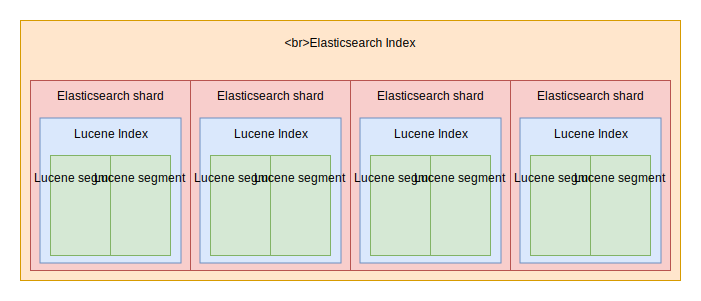

```
WIP, COVERS ELASTICSEARCH 5.5.x, UPDATING TO ES 6.5.x
```

# 关于Lucene你需要知道的

在你开始考虑选择合适的硬件前，有一些关于[Lucene](http://lucene.apache.org/)你需要知道的。

Lucene是Elasticsearch所使用的搜索引擎的名字，它是一个来自Apache基金会的开源项目。当运行Elasticsearch的时候，在大部分情况下，我们不需要直接和Lucene交互。但是有一些在我们选择集群存储和文件系统前需要知道的重要的事情。

## Lucene段

每个Elasticsearch索引都被分为分片。分片既是一个索引的逻辑也是物理划分。每个Elasticsearch分片都是一个Lucene索引。在一个Lucene索引中你可以拥有的最大文档数是2,147,483,519。Lucene索引被分为更小的称为段的文件，一个段是一个小的Lucene索引。Lucene按顺序搜索所有段。



当一个新的writer被打开，以及一个writer被提交或者被关闭时，Lucene会创建一个段。这意味着段是不可变的。当你向Elasticsearch索引中加入新的文档，Lucene创建一个新的段并且写入它。当索引的吞吐量很重要时，Lucene也能创建更多的段。

Lucene不时地将较小的段合并为较大的段。 也可以使用Elasticsearch API手动触发合并。

从操作的角度来看，这种行为会产生一些影响。

集群中拥有的段越多，搜索的速度也越慢。这是因为Lucene需要顺序地搜索这些所有的段，而不是并行的。因此拥有少量的段可以加快搜索速度。

Lucene的合并操作需要CPU和I/O开销，这意味着它们可能减慢你的索引速度。当执行一个bulk索引时，比如初始化索引，推荐完全地停止合并操作。

如果你计划在同一台机器上存储许多分片和段，您可能需要选择一个能够很好地处理大量小文件的文件系统，并且没inode限制。关于选择正确的文件系统的部分我们将详细讨论。

## Lucene删除和更新

在更新和删除文档时，Lucene会执行写时拷贝。这意味着文档永远不会从索引中被删除。相反，Lucene将文档标记为已删除，并在触发更新文档时创建另一个文档。

写时拷贝带来的操作后果是，当你更新或删除文档时，除非你完全删除它们，否则磁盘上索引空间将不断增长。一种实际删除被标记的文档的解决方案是强制Lucene进行段合并。

在合并时，Lucene将2个段的内容移动到第三个新段，然后从磁盘中删除旧段。这意味着Lucene需要足够的可用空间来创建一个和需要合并的两个段大小相同的段。

当强制合并一个巨大的分片时可能会出现问题。如果这个分片大小\>磁盘大小的一半，那么你可能无法完全合并它，除非分片中大多数数据都是由已删除的文档组成的。
